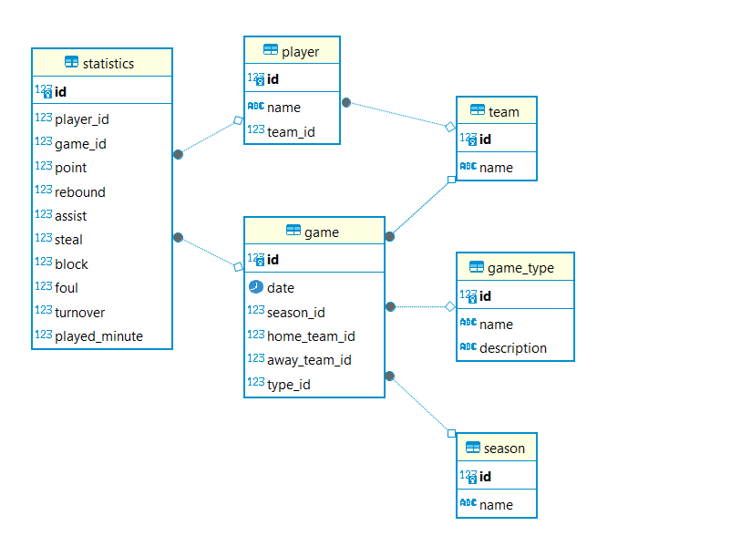

# Scalable system for NBA player's statistics(points, rebounds, assists, etc)

## Pre-requisites
For the task we will use the Postgres relational database, so we will run it on Docker:

```bash
# install DB
$ docker run --name testDB -e POSTGRES_USER=testUser -e POSTGRES_PASSWORD=testPassword -e POSTGRES_DB=testDB -h 127.0.0.1 -p 5432:5432 -d postgres
```

## Build Setup
To deploy this project, **Java 17** or higher is required and **Maven 3.8.1** or higher is required and **Docker Compose version 1.13.0** or higher is required.
Start next steps from work directory ../nba-player-stats
```bash
# Build the project and install the resulting artifacts in the local Maven repository 
$ mvn install

# Build the Docker image for the project 
$ docker build -t nba-player-stats .

# Initialize Docker Swarm mode
$ docker swarm init

# Deploy the stack defined in docker-compose.yml to the Docker Swarm cluster
$ docker stack deploy -c docker-compose.yml my_stack

```
## To view and interact with the API, use the following links

- [Swagger UI](http://localhost:8080/swagger-ui/index.html) - Web interface for testing the API.
- [API Docs](http://localhost:8080/v3/api-docs) - Raw API data in OpenAPI format.


## Structure of data storage in a relational database



## Horizontal Scaling

By default, 2 instances of the application are started. To scale horizontally, modify the value of `services.web.deploy.replicas` in the `docker-compose.yml` configuration file.

To view information about the used instances, you can use [http://localhost:8080/instance-info](http://localhost:8080/instance-info)

## To rollback to the initial state, use the following commands:
```bash
$ docker stack rm my_stack
$ docker swarm leave --force
```

